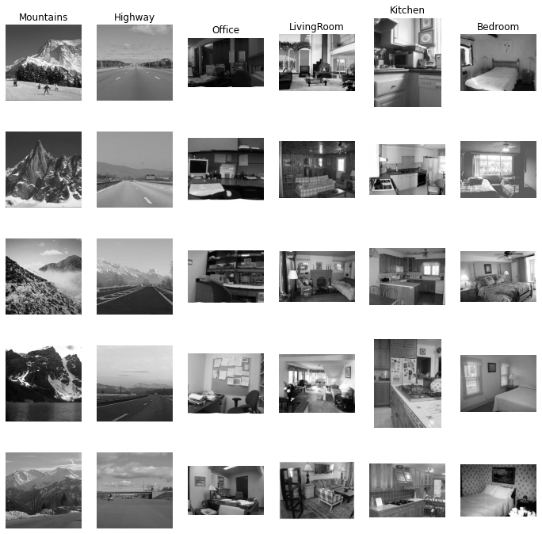

# Scene Recognition using SIFT 

Scene Classification is implemented using Tiny Image feature and Bag of Visual Words of SIFT features.

🌄 🗾 🌠 🎑 🌅 🏞 🌁 🌄 🗾 🌠 🎑 🌅 🏞 🌁

✅ Tiny Image features are extracted by resizing images to fixed size 16x16. 

✅ Bag of Visual Words created by using all SIFT descriptors of images as features. 

✅ KMeans clustering is implemented to create vocabulary. 

`😶 Tiny Image features are not representative enough as they are not robust to scale, rotation, brightness changes etc. in an image. 

📉 KNN Accuracy: 34%

📉 Linear SVM Accuracy: 37%

🤩 SIFT descriptors are robust to scale, rotation, brightness changes because descriptors are created considering the finest gradient change in the keypoint patch.

📈 KNN Accuracy: 55%

📈 Linear SVM Accuracy: 70%`

An Example Classification Result: 

This model's performance can be further developed by using different and faster clustering methods for vocabulary building.
Also, number of features can be reduced by eliminating some of the descriptors. Better strategies can be applied to select descriptors as features. (TFIDF etc.)

**RUN**: `python run.py 'path/to/dataset'`

NOTE: 
- opencv-python==4.5.1 is required to use SIFT_create().

- Python 3.7.7 is used in this project. 
